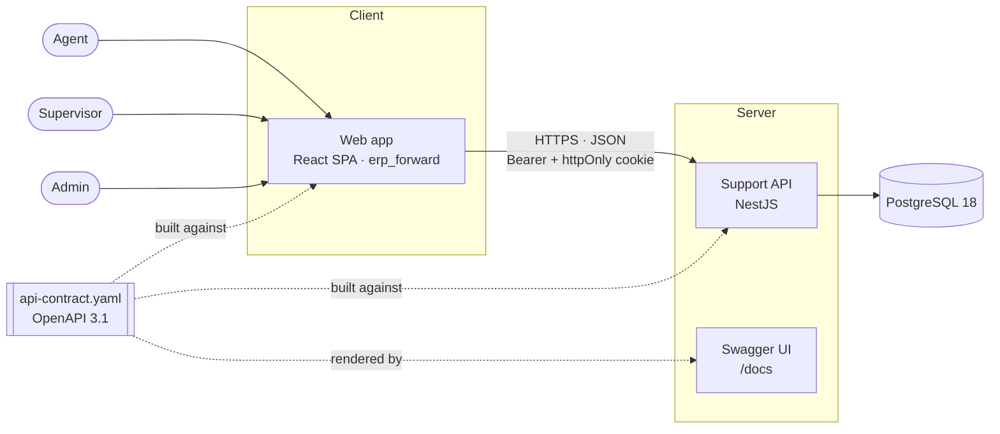
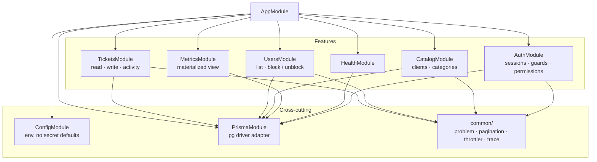
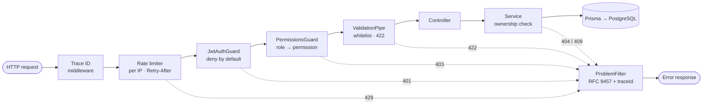
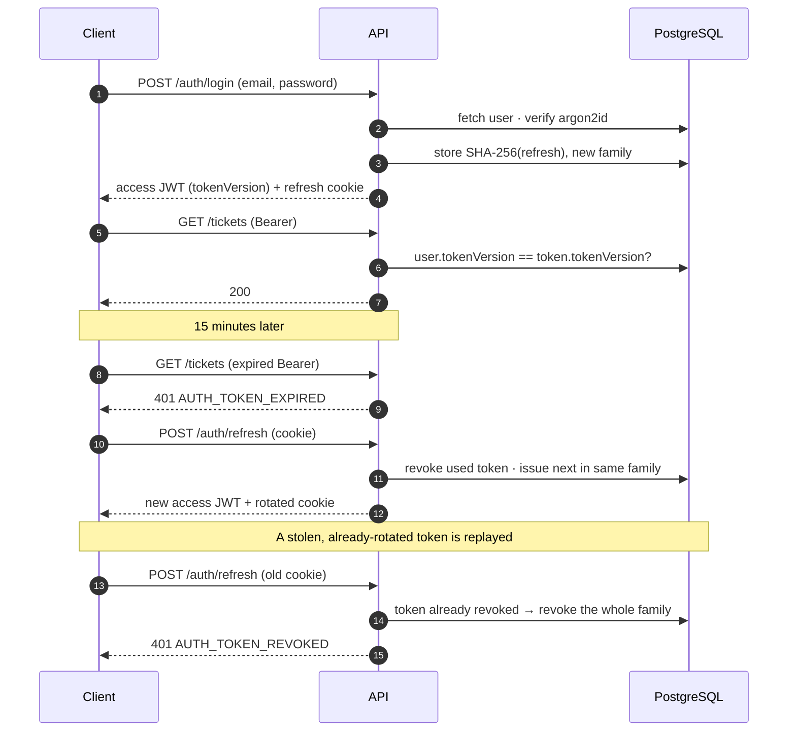
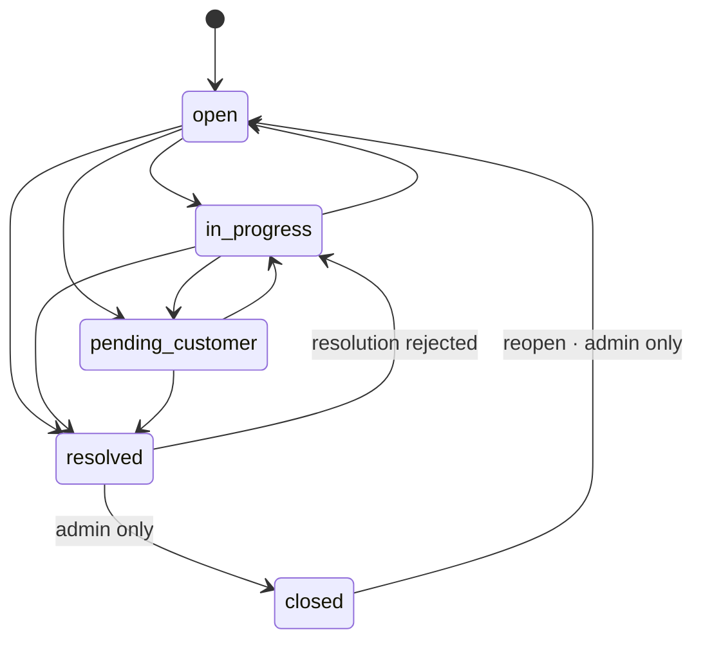
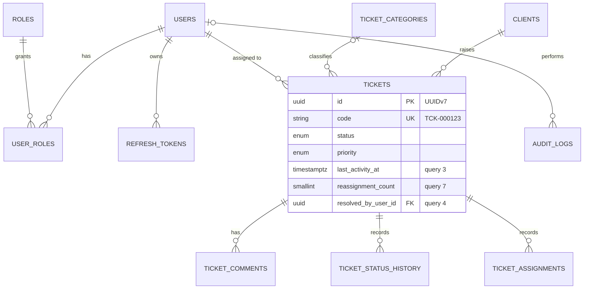
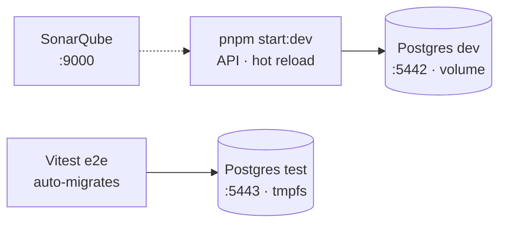
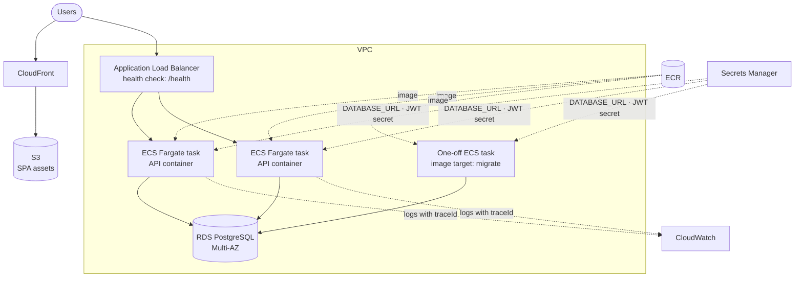
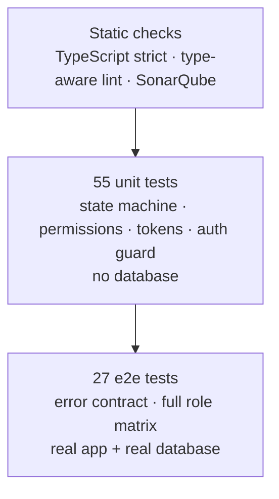

# Architecture — Support Ticket Platform API

A stateless, contract-first REST API for managing support tickets: intake,
assignment, status workflow and full traceability, with role- and
ownership-based access control.

> This document describes **how** the system is built. The **why** behind each
> decision — including the costs we accepted and when we would revisit them —
> lives in [`DECISIONES-TECNICAS.md`](DECISIONES-TECNICAS.md) (Spanish).

---

## At a glance

| | |
|---|---|
| **Style** | Modular monolith, stateless, horizontally scalable |
| **API** | REST, contract-first (OpenAPI 3.1), RFC 9457 errors, keyset pagination |
| **Runtime** | Node.js 24 · NestJS 12 · TypeScript strict |
| **Data** | PostgreSQL 18 · Prisma 7 (driver adapter) · plain SQL where it matters |
| **Security** | Short-lived JWT + rotating opaque refresh token · argon2id · RBAC + ownership |
| **Quality** | 55 unit + 27 e2e tests, validated through mutation · type-aware linting · SonarQube |
| **Delivery** | Multi-stage container · health check · graceful shutdown · AWS-ready |

**Numbers that matter**, measured on 100,000 tickets and ~660,000 history rows:
the two queries most sensitive to volume (stale tickets, frequently reassigned
tickets) run in **under 1 ms** through purpose-built indexes. See
[`EXPLAIN.md`](EXPLAIN.md).

---

## 1. System context

The API and the web app are **separate repositories** coupled only through
`api-contract.yaml`. Both teams build against that file; Swagger renders it
verbatim, so documentation cannot drift from what either side implements.

---

## 2. Module structure

Each feature module owns its controllers, services and DTOs. Inside a feature,
responsibilities are split by reason to change rather than by layer name — for
example, tickets are served by three services: **reads**, **writes** (status,
assignment, edits) and **activity** (comments, history).

---

## 3. Request pipeline

Every request walks the same fixed chain. The order is deliberate: cheap
rejections happen first, and nothing reaches a controller without being
authenticated, authorized and validated.

- **Deny by default.** The authentication guard is global; a route must opt out
  explicitly with `@Publico()`. A new endpoint is born protected.
- **Two authorization layers.** The guard checks *what a role may do*; the
  service checks *which row* — an agent allowed to edit tickets may only edit
  **their** tickets. Checking the role but not ownership is the most common
  authorization bug, so both are enforced.
- **One error shape.** Every failure — including unexpected 500s — leaves as
  `application/problem+json` with a stable `code` and a `traceId` that matches
  the server log. Internal details never reach the response body.

---

## 4. Authentication and session lifecycle

Two tokens with different jobs:

| Token | Lifetime | Carried in | Stored as |
|---|---|---|---|
| Access (JWT) | 15 min | `Authorization: Bearer` | client memory only, never `localStorage` |
| Refresh (opaque) | 7 days | `httpOnly; Secure; SameSite=Strict; Path=/auth` cookie | SHA-256 hash in the database |

**Blocking a user takes effect on the very next request**, not when the token
expires: blocking increments `token_version`, which the guard compares against
the database on every call, and revokes every refresh token. That per-request
lookup is a primary-key read; moving it to Redis later is a change confined to
the guard.

Brute-force protection is layered and intentionally split: **per-IP rate
limiting** stops one address hammering the endpoint, while **per-account
lockout** stops attacks distributed across many addresses. The automatic
lockout never touches the administrative `blocked` status.

---

## 5. Ticket workflow

- The state machine lives in one place on the server. The ticket detail exposes
  `allowedStatusTransitions` — the machine intersected with the caller's role
  and ownership — so the client renders the right actions without duplicating
  the rules.
- Reopening is not a state: it returns the ticket to `open`, increments
  `reopened_count` and clears the previous resolution.
- Every write (status, assignment, comment, edit) runs in **one transaction**
  that covers the ticket row, its history row, denormalized counters and
  `last_activity_at`.
- **Optimistic concurrency** without version fields: writes include the value
  they read in the `WHERE` clause; if another request changed it in between,
  no row matches and the API answers `409 CONFLICT` instead of overwriting.

---

## 6. Data model

Eleven tables in three blocks: **identity and access**, **operations** and
**traceability**. Highlights:

- **Designed backwards from the queries.** Three columns exist only because a
  required query needs them, and each one is documented with its reason.
- **Time-ordered UUIDv7 keys**: B-tree locality without leaking business volume
  through sequential IDs. The human-facing `TCK-000123` code comes from a
  database sequence, atomic under concurrency.
- **Typed, append-only history** (`ticket_status_history`,
  `ticket_assignments`) instead of a generic JSON event table: queries stay
  indexed and referentially sound.
- **Enums for workflow, tables for catalogs**: status and priority are Postgres
  enums the code branches on; clients and categories are data the business edits.

Full model: [ER diagram](https://www.drawdb.app/editor?shareId=c7c2bb718cc409d8b5125b76deb767c6)
· [`prisma/schema.prisma`](../prisma/schema.prisma).

---

## 7. Scaling for volume

| Technique | Where | Effect |
|---|---|---|
| Keyset pagination, no total count | Every list endpoint | Page 10,000 costs the same as page 1 |
| Partial index | Stale tickets (`last_activity_at`, open only) | Indexes live tickets only: ~4× smaller, fits in cache |
| Index that also provides the `ORDER BY` | Reassigned tickets | `LIMIT` stops the scan early: 337 buffers vs 7,728 |
| Trigram GIN indexes | Title and client name search | `ILIKE '%text%'` without a full scan |
| Materialized view, `REFRESH CONCURRENTLY` | Dashboard metrics | Global aggregates computed every 5 min, not per page load |
| Denormalized counters, kept transactionally | `reassignment_count` | Avoids aggregating the full history — only valuable because it is indexed |
| Summary vs detail shapes | Ticket list | Lists never ship `description` or per-row counts |

The measured trade-offs, including a conclusion we had to correct after an
unfair comparison, are in [`EXPLAIN.md`](EXPLAIN.md).

---

## 8. Deployment

### Local

### AWS (target)

The container is built for this environment:

- **Stateless** — sessions live in the database, so tasks scale horizontally
  with no sticky sessions.
- **No secrets in the image** — every secret arrives through environment
  variables injected from Secrets Manager; the same image runs everywhere.
- **Non-root user**, **health check** against `/health` (503 if the database
  does not answer within 2 s) and **graceful shutdown** on `SIGTERM`, so a
  rolling deployment never cuts in-flight requests.
- **Migrations as a separate job** run before each rollout, from a dedicated
  image stage; the runtime image does not ship migration tooling.
- Front end and API share a registrable domain (`app.` / `api.`) so the
  `SameSite=Strict` refresh cookie keeps working.

**When scaling past one task:** the rate limiter moves from process memory to
Redis or AWS WAF rate-based rules (otherwise each task counts separately), and
the `token_version` lookup can move to ElastiCache.

---

## 9. Patterns catalogue

| Pattern | Where | Why |
|---|---|---|
| **Contract-first API** | `docs/api-contract.yaml` | Front and back build in parallel against one source of truth |
| **Modular monolith** | NestJS feature modules | Clear boundaries without distributed-system overhead |
| **Deny-by-default guard chain** | Global guards + `@Publico()` | New endpoints are protected unless explicitly opened |
| **RBAC + ownership checks** | `PermissionsGuard` + `cargarTicketVisible` | Role says *what*, ownership says *which row* |
| **404 instead of 403 for hidden resources** | Ticket access | Does not confirm a resource exists to someone who cannot see it |
| **State machine** | `status-transitions.ts` | One table drives validation and the UI's allowed actions |
| **Optimistic concurrency** | Status and assignment writes | No lost updates, no locks held across requests |
| **Transactional denormalization** | `reassignment_count`, `last_activity_at` | Fast reads, kept honest by the same transaction as the source |
| **Read model** | `dashboard_metrics` materialized view | Expensive aggregates precomputed, stamped with `generatedAt` |
| **Append-only audit trail** | History tables, `audit_logs` | History that cannot be edited is history you can trust |
| **Refresh token rotation with reuse detection** | `TokenService` | A replayed token reveals theft and revokes the whole session family |
| **Problem Details (RFC 9457)** | `ProblemFilter` | One error path for the client, stable codes to branch on |
| **Keyset pagination** | `common/pagination` | Constant cost per page at any depth |
| **Twelve-factor configuration** | `EnvService` | Config from the environment, no defaults for secrets |
| **Health check + graceful shutdown** | `/health`, `enableShutdownHooks` | Safe load balancing and zero-downtime rollouts |

---

## 10. Quality strategy

- **Unit tests target pure, critical logic**: the state machine is checked
  against a copy of the contract's table, so an unagreed rule change fails.
- **End-to-end tests cover the role matrix** from the brief: for each role,
  what is allowed and what is forbidden, including someone else's ticket → 404.
- **Tests were validated through mutation**: five deliberate bugs were injected
  (e.g. letting agents see other people's tickets); every one was caught.
- The e2e suite migrates its own ephemeral database and refuses to run against
  anything whose name does not end in `_test`.

---

## 11. Further reading

| Document | Content |
|---|---|
| [`DECISIONES-TECNICAS.md`](DECISIONES-TECNICAS.md) | Every decision with its reason, accepted cost and revisit trigger |
| [`api-contract.yaml`](api-contract.yaml) | The API contract (also served at `/docs`) |
| [`EXPLAIN.md`](EXPLAIN.md) | Measured query plans on 100,000 tickets |
| [`KNOWN_ISSUES.md`](KNOWN_ISSUES.md) | Diagnosed problems with cause and fix |
| [`../queries.sql`](../queries.sql) | The eight queries required by the brief |
