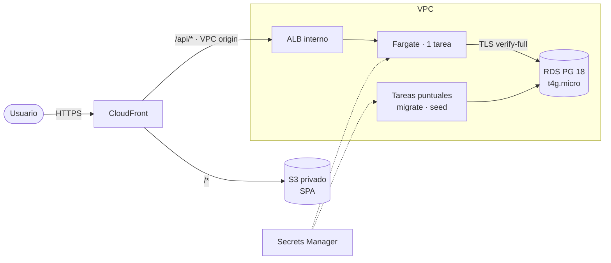

# Decisiones técnicas — Plataforma de gestión de tickets de soporte

> Documento base para la sustentación. Cada decisión está escrita como
> **decisión → por qué → qué costo acepto → cuándo la cambiaría**.
> Una decisión que no se puede defender con esas cuatro líneas no entra al proyecto.
>
> Cómo está construido el sistema: [`ARCHITECTURE.md`](ARCHITECTURE.md).
> Números medidos: [`EXPLAIN.md`](EXPLAIN.md).

## Índice

0. [Lectura del enunciado](#0-lectura-del-enunciado)
1. [Modelo de datos](#1-modelo-de-datos)
2. [Contrato de la API](#2-contrato-de-la-api)
3. [Autenticación y sesiones](#3-autenticación-y-sesiones)
4. [Autorización: roles y pertenencia](#4-autorización-roles-y-pertenencia)
5. [Flujo del ticket](#5-flujo-del-ticket)
6. [Seguridad](#6-seguridad)
7. [Grandes volúmenes](#7-grandes-volúmenes)
8. [Calidad y pruebas](#8-calidad-y-pruebas)
9. [Despliegue en AWS](#9-despliegue-en-aws)
10. [Estado y trabajo futuro](#10-estado-y-trabajo-futuro)

---

## 0. Lectura del enunciado

El PDF recibido llega **truncado**: los campos del ticket, la lista de estados y
prioridades, y varios ítems de las vistas del front aparecen como `• ...`.

Los anclajes duros y no negociables son las **8 consultas de `queries.sql`**:
definen qué preguntas tiene que poder responder el modelo. El esquema se diseñó
*desde esas consultas hacia atrás*: si una consulta necesita un dato que no
existe, o que solo se obtiene escaneando el historial completo, el modelo está mal.

Todo lo elidido se propuso y está marcado como asunción explícita.

---

## 1. Modelo de datos

**11 tablas, 3 bloques:** identidad y acceso · operación · trazabilidad.
Diagrama: [drawDB](https://www.drawdb.app/editor?shareId=c7c2bb718cc409d8b5125b76deb767c6).

### Enums vs tablas de catálogo

| Concepto | Decisión | Razón |
|---|---|---|
| `ticket_status`, `ticket_priority`, `user_status` | **ENUM de Postgres** | Son parte del *flujo*: el código ramifica sobre ellos. Son pocos y estables. El tipo hace que la BD rechace un valor inválido, no solo el DTO. |
| `clients`, `ticket_categories`, `roles` | **Tabla** | Los administra el negocio y cambian sin deploy. |

**Costo que acepto:** agregar un estado nuevo exige `ALTER TYPE`. Es un cambio de
flujo de negocio, no de datos: quiero que duela un poco y pase por revisión.
**Cuándo lo cambio:** si el negocio pide configurar sus propios estados por área,
`ticket_status` pasa a tabla con máquina de estados en `status_transitions`.

### Estados y prioridades propuestos

- **Estados:** `open` → `in_progress` → `pending_customer` → `resolved` → `closed`.
  Reabrir **no** es un estado: devuelve el ticket a `open` e incrementa
  `reopened_count`. Un estado `reopened` sería redundante con el contador y
  ensuciaría todas las consultas de "abiertos".
- **Prioridades:** `low`, `medium`, `high`, `critical` (la consulta 2 exige
  distinguir alta de crítica).

### Los tres campos que existen solo por las consultas

Muestran que el modelo se diseñó contra la consulta y no al revés:

1. **`tickets.last_activity_at`** — la consulta 3 pide "más de 48 h sin
   actualización". `updated_at` **no cambia cuando alguien comenta**: usarlo
   marcaría como estancados tickets con actividad real. `last_activity_at` se
   toca en cualquier evento del ticket (comentario, cambio de estado,
   reasignación) y lleva índice parcial `WHERE status <> 'closed'`.
   En la escritura del comentario se actualiza con SQL directo y no con el ORM,
   porque el ORM rellenaría `updated_at` solo y rompería justo esta distinción.

2. **`tickets.reassignment_count`** — la consulta 7 (reasignados más de dos
   veces) desde `ticket_assignments` es un `GROUP BY ... HAVING count(*) > 2`
   sobre el historial completo. El contador desnormalizado evita esa
   agregación, y se actualiza en la **misma transacción** que inserta en
   `ticket_assignments`: sin transacción, la desnormalización es una mentira
   esperando a pasar.

   **Corrección tras medir sobre 100.000 tickets:** el contador por sí solo no
   arregla nada. Medido sobre la consulta real de `queries.sql` —la que devuelve
   cliente y agente, no solo identificadores— en páginas leídas por la
   **consulta completa**:

   | Variante | Páginas | Plan |
   |---|---|---|
   | Contador, **sin** índice | 5.284 | `Seq Scan` + `Sort` |
   | Agregar el historial, misma salida | 7.728 | `HashAggregate` + `Seq Scan` de tickets |
   | Agregar el historial, solo `ticket_id` | 2.444 | `HashAggregate` |
   | **Contador, con índice** | **337** | **`Index Scan`, sin `Sort`** |

   **El contador sin índice no gana de forma clara a la agregación que pretendía
   sustituir.** El salto de verdad, un orden de magnitud, lo da el índice
   `(reassignment_count DESC, created_at DESC)`: 337 páginas y ~0,9 ms.

   La lección general: **desnormalizar sin indexar la columna desnormalizada no
   es una optimización, es solo una copia del dato que hay que mantener
   sincronizada.** El beneficio no vino de duplicar el dato, sino del índice que
   ese dato hizo posible. Las páginas leídas son la métrica estable; los tiempos
   varían con la caché.

3. **`tickets.resolved_by_user_id`** — la consulta 4 pide el usuario con más
   tickets resueltos. Usar `assigned_to_user_id` sería incorrecto: un ticket
   puede reasignarse *después* de resuelto, y el crédito se le daría al agente
   equivocado.

### Historial: dos tablas explícitas, no un `events` genérico

`ticket_status_history` y `ticket_assignments` en vez de una tabla
`ticket_events` con `type` + `payload JSONB`.

**Por qué:** las consultas 4 y 7 salen tipadas, indexadas y legibles. Con JSONB
serían `payload->>'to_user_id'` sin integridad referencial.
**Costo:** una tabla nueva por cada tipo de evento auditable del ticket.
**Cuándo lo cambio:** si aparecen 5 o más tipos de evento de baja consulta, esos
van a `audit_logs` (que ya es genérico con JSONB) y las dos tablas tipadas se
quedan para lo que se consulta de verdad.

Ambas son **append-only**: sin `UPDATE` ni `DELETE`. Un historial editable no es
historial.

### Roles: N:M

`users` ←→ `user_roles` ←→ `roles`.

**Por qué N:M y no un enum en `users`:** en operación real un líder también
atiende tickets. Con 1:N habría que duplicar usuarios o inventar un rol
`supervisor_agente`, que es exactamente el tipo de deuda que se multiplica.
Con N:M, quien tiene varios roles recibe la unión de sus permisos.

### Convenciones

- **PK `UUIDv7`** en entidades de negocio (nativo en PostgreSQL 18): ordenado por
  tiempo, así mantiene localidad en el B-tree (el problema clásico de UUIDv4 son
  los page splits) y **no filtra volumen de negocio**: un `serial` en la URL le
  dice a cualquiera cuántos tickets tienes y habilita enumeración.
  **Excepción:** `audit_logs` usa `BIGINT` autoincremental: append-only masivo y
  nadie referencia esas filas desde fuera.
- **`tickets.code`** (`TCK-000123`) es el identificador *humano*, el que se dice
  por teléfono. Lo genera **una secuencia de la base**: calcular `max() + 1` en
  la aplicación no es atómico y dos altas simultáneas chocarían.
- `TIMESTAMPTZ` siempre, nunca `TIMESTAMP`.
- Soft delete (`deleted_at`) donde hay historial que preservar; borrado físico
  en `refresh_tokens`.
- `snake_case` en BD, `camelCase` en la API: el ORM traduce.

---

## 2. Contrato de la API

### El contrato OpenAPI es la fuente de verdad

**Decisión:** la API se construyó contra `docs/api-contract.yaml`, escrito antes
que el código. Swagger (`/docs`) sirve ese mismo fichero tal cual; no se genera
un segundo contrato desde decoradores.
**Por qué:** front y back viven en repositorios distintos y se construyeron en
paralelo. Con un único contrato, un desajuste se detecta como "no cumple el
contrato" y no como un error de integración a última hora. Dos contratos
—uno escrito y otro generado— acaban divergiendo.
**Costo:** cada cambio de la API empieza por editar el YAML.
**Cuándo lo cambio:** si el equipo creciera hasta que mantener el YAML a mano
fuera un cuello de botella, se generaría desde código **y se validaría en CI
contra el contrato publicado**.

### Errores: RFC 9457 siempre

Toda respuesta de error, incluidos los 500 no previstos, sale como
`application/problem+json` con un `code` estable sobre el que ramifica el
cliente y un `traceId` que correlaciona con el log. El `title` es texto para
humanos y puede cambiar sin romper nada. El detalle de un error interno va al
log, nunca al cuerpo.

Los códigos se separan cuando **el cliente debe reaccionar distinto**:

- **Cuatro 401.** `AUTH_TOKEN_EXPIRED` (renovar y reintentar),
  `AUTH_TOKEN_REVOKED`, `AUTH_USER_BLOCKED` y `AUTH_TOKEN_INVALID` (cerrar
  sesión). Devolver "expirado" para un token roto manda al cliente a renovar en
  vano, y como el refresh no arregla un token roto, el resultado es un bucle.
- **Tres 409.** `INVALID_STATUS_TRANSITION` (no reintentar), `CONFLICT` (cambio
  concurrente: recargar) y `TICKET_CLOSED` (solo el admin reabre).
- **409 y no 422** para una transición no permitida: la petición es válida; lo
  que no la admite es el estado del recurso.

### Listados: keyset y sin total

**Decisión:** `limit` + `cursor` opaco; respuesta `{ data, pageInfo: { nextCursor, hasMore } }`,
**sin total**. `nextCursor` es obligatorio y admite `null`: así el cliente
distingue "no hay más páginas" de "no me lo mandaron".
**Por qué:** con `OFFSET` la página 10.000 cuesta 10.000 veces la primera, y el
`COUNT(*)` sobre el filtro es precisamente la consulta que se cae con millones de
filas. Se piden `limit + 1` filas para saber si hay más sin contar.
**Costo:** la UI no puede mostrar "página 7 de 312".
**Cuándo lo cambio:** si el negocio necesitara un total, sería un endpoint
aparte, cacheado o aproximado, nunca un conteo en el listado.

### Resumen y detalle, formas distintas

El listado no devuelve `description` ni `commentCount`: en una tabla de 25
filas, el cuerpo completo es ancho de banda tirado y el conteo por fila es una
agregación en la ruta más caliente. El detalle sí los trae, porque ahí es una
sola fila.

---

## 3. Autenticación y sesiones

Dos tokens con propósitos distintos: **access JWT de 15 minutos** en la cabecera
`Authorization`, guardado solo en memoria del cliente; **refresh opaco de 7
días** en cookie `httpOnly; Secure; SameSite=Strict; Path=/auth`, del que en base
solo se guarda el SHA-256.

**Rotación con detección de reuso:** cada refresh invalida el token usado y
emite otro de la misma familia. Si llega un token ya rotado, se asume robo —el
usuario legítimo y el ladrón no pueden usar el mismo token dos veces— y se
revoca la **familia entera**. Rotar y emitir van en una transacción: a medias,
o se pierde la sesión o quedan dos vivas.

**`Secure` también en desarrollo.** `localhost` es contexto seguro en los
navegadores modernos. Hacerlo condicional crearía una divergencia entre
desarrollo y producción justo en un atributo de seguridad, que es como se acaba
desplegando sin él.

### Qué pasa cuando bloqueo a alguien

Es la pregunta trampa del proceso, porque con JWT la respuesta ingenua ("le
pongo `active = false`") **no funciona**: el token ya emitido sigue siendo válido
hasta que expire.

La respuesta está en el modelo —`users.token_version` y `refresh_tokens`— y se
ejecuta en una sola transacción:

1. `status = 'blocked'` + `blocked_at` / `blocked_by_user_id` / `blocked_reason`.
2. **`token_version++`**: el access token lleva esa versión en el claim; en
   cada petición el guard la compara con la del usuario y, si no coinciden,
   responde `401 AUTH_TOKEN_REVOKED`.
3. Revocación de todos sus refresh tokens: no puede renovar.
4. Registro en `audit_logs` (`user.blocked`), con IP y user-agent.

Un administrador no puede bloquearse a sí mismo (409): dejaría el sistema sin
quien desbloquee.

**El trade-off honesto:** el paso 2 exige conocer `token_version` en cada
petición, y eso cuesta una lectura.

| Opción | Coste | Qué puedo prometer |
|---|---|---|
| No comprobar; confiar en el TTL | Cero | El bloqueo tarda **hasta 15 minutos** |
| Comprobar contra Postgres | Un lookup por PK, sub-milisegundo | El bloqueo es **inmediato** |
| Comprobar contra Redis | Una lectura en memoria | El bloqueo es **inmediato** |

**Decisión:** comprobar **contra Postgres**. Sacrifica parte de la ventaja del
JWT sin estado, y se asume a conciencia: el requisito real no es "que el token
sea puro", es "que un usuario bloqueado no pueda seguir entrando". Con la
primera opción, la respuesta honesta sería "durante un cuarto de hora, sí", que
no es una respuesta. Además, los roles se leen de la base y no del token: quitar
un rol surte efecto sin esperar a que expire el JWT.
**Cuándo lo cambio:** cuando el volumen de peticiones lo justifique, esa lectura
se mueve a Redis (`user:{id}:tv`, TTL corto). Es un cambio localizado en el
guard y no toca ni el modelo ni el contrato.

### Fuerza bruta: dos defensas distintas

- **Rate limiting por IP** en `/auth` (5 logins/min): frena a una dirección
  martilleando. El 429 lleva `Retry-After` en segundos, **expuesta por CORS**:
  sin exponerla, el navegador se la oculta al cliente sin ningún error.
- **Bloqueo de cuenta** tras 5 intentos fallidos (`failed_login_attempts` +
  `locked_until`): frena un ataque repartido entre muchas IPs contra una cuenta.

Deliberadamente **separado** de `status = 'blocked'`, que es administrativo.
Mezclarlos significa que un ataque de fuerza bruta contra un admin lo bloquea
administrativamente y hace falta otro admin para restaurarlo.

El login responde **idéntico** exista o no el email: distinguirlos permitiría
enumerar cuentas.

---

## 4. Autorización: roles y pertenencia

**Decisión:** dos capas. El guard comprueba **qué puede hacer el rol**; el
servicio comprueba **sobre qué fila**. Un agente con permiso de editar tickets
solo edita los **suyos**.
**Por qué:** comprobar el rol y no la pertenencia es el fallo de autorización
más común que existe.

**404 y no 403** cuando el recurso existe pero no es visible para quien pregunta:
un 403 distinguible confirma que el recurso existe y permite enumerar.

**Los permisos viven en código** (`src/auth/permissions.ts`), no en BD: hoy son
estáticos, y en código son testeables y revisables en el PR.
**Cuándo lo cambio:** cuando el negocio pida permisos configurables por UI
aparece `role_permissions`. Regla de tres: no antes.

### Matriz de roles

| Acción | Admin | Supervisor | Agente |
|---|:-:|:-:|:-:|
| Ver tickets | todos | todos | solo asignados |
| Crear | ✓ | ✓ | ✓, queda autoasignado |
| Editar | ✓ | — | solo asignados |
| Cambiar estado | ✓ | — | solo asignados |
| Cerrar / reabrir | ✓ | — | — |
| Asignar / reasignar | ✓ | ✓ | — |
| Comentario interno | crea y lee | crea y lee | solo lee |
| Bloquear usuarios | ✓ | — | — |

Decisiones que la matriz esconde:

- **El supervisor no edita ni cambia estados.** El enunciado da "actualizar
  cualquier ticket" solo al admin y el cambio de estado al agente sobre sus
  asignados. El supervisor ve toda la operación, crea, reasigna y comenta.
- **El agente que crea un ticket se lo queda asignado.** Si quedara en la
  bandeja sin asignar, el agente no podría volver a verlo justo después de
  crearlo, porque solo ve los suyos.
- **"Interno" significa "no visible para el cliente", no "solo para mandos".**
  El agente lee las notas internas del ticket que atiende: ocultárselas le haría
  trabajar con menos información de la que existe sobre su propio caso, y la
  otra lectura convertiría el campo en un canal para hablar del agente sin que se
  entere. El filtro ya está en la consulta, para el día que exista un portal de
  cliente o un rol sin ese permiso. Ocultarlo por CSS sería una filtración.

---

## 5. Flujo del ticket

### Máquina de estados en el servidor

| Desde | Hacia |
|---|---|
| open | in_progress, pending_customer, resolved |
| in_progress | open, pending_customer, resolved |
| pending_customer | in_progress, resolved |
| resolved | in_progress, closed (admin) |
| closed | open (admin, reapertura) |

**El cliente no replica la tabla:** el detalle del ticket trae
`allowedStatusTransitions`, calculado con la misma tabla que valida el cambio e
intersectado con el rol y la pertenencia de quien pregunta. Si el front copiara
la regla, el día que cambie aquí seguiría ofreciendo botones que el servidor
rechaza.

- **`resolved → in_progress`** está permitido: el cliente no aceptó la
  resolución. No cuenta como reapertura, pero **deshace la resolución**
  (`resolved_at` y `resolved_by` vuelven a nulo); si no, las consultas 4 y 5
  contarían una resolución que ya no existe. El historial conserva lo que pasó.
- **Reabrir** vuelve a `open`, incrementa `reopened_count` y limpia también
  `closed_at`.

### Definición única de ticket "abierto"

**Abierto = `open`, `in_progress` o `pending_customer`.** Un `resolved` espera
cierre y no requiere acción de ningún agente. Todo lo que el producto llama
"abierto", "estancado" o "sin asignar" parte de este conjunto, así que estancados
y sin asignar son siempre subconjuntos de abiertos.

La consulta 3 de `queries.sql` sigue literal el enunciado ("no están cerrados")
e incluye los resueltos. La diferencia es deliberada y está explicada allí.

### Transacciones y concurrencia

Cada escritura —cambio de estado, asignación, comentario, edición— va en **una
transacción** que cubre la fila del ticket, su fila de historial, los contadores
y `last_activity_at`.

**Concurrencia optimista sin columna de versión:** la escritura incluye en el
`WHERE` el valor que leyó (el estado, el asignado). Si otra petición lo cambió
entre medias, no se actualiza ninguna fila y se responde `409 CONFLICT` en vez de
pisar el cambio.
**Costo:** el cliente debe recargar y reintentar.
**Cuándo lo cambio:** si hubiera ediciones concurrentes frecuentes sobre los
mismos campos de texto, una columna `version` con `If-Match`.

---

## 6. Seguridad

| Riesgo | Medida |
|---|---|
| Robo de la BD | `password_hash` con **argon2id**; `refresh_tokens.token_hash` guarda SHA-256, nunca el token plano |
| Robo de refresh token | Rotación con `family_id`: si se reusa un token ya rotado, se revoca la familia completa |
| Usuario bloqueado con token vivo | `token_version` comprobado contra la base en cada petición |
| Enumeración de recursos | UUID en las URLs; **autorización por recurso** y 404 para lo que no es visible |
| Enumeración de cuentas | Login con respuesta idéntica exista o no el email |
| Fuerza bruta | Rate limiting por IP + bloqueo de cuenta por intentos, separados del bloqueo administrativo |
| Fuga de datos internos | `is_internal` se filtra **en la consulta**; `password_hash` nunca se selecciona fuera del login |
| SQL injection | Consultas parametrizadas vía ORM y `$executeRaw` con plantillas; el orden va contra una allowlist de columnas. El único `$executeRawUnsafe` está en el seed y ejecuta un fichero versionado sin entrada externa |
| XSS sobre la sesión | Access token solo en memoria; refresh en cookie `httpOnly` |
| CSRF | Cookie `SameSite=Strict` y limitada a `Path=/auth` |
| CORS | Origen concreto por entorno, nunca `*`; solo se exponen las cabeceras que el cliente necesita |
| Trazabilidad | `audit_logs` con actor, IP y user-agent, con la regla de **no** guardar tokens ni contraseñas en `metadata` |
| Secretos | Solo por entorno o secret manager, sin defaults: si faltan, la app no arranca. Ni en el repo, ni en la imagen, ni en los logs |
| Credenciales de prueba | El seed no guarda el hash de una contraseña conocida; las cuentas de prueba reciben la suya de `SEED_PASSWORD` |
| Superficie expuesta | Swagger apagado por defecto en producción; el scanner de SonarQube recibe solo su token, no el `.env` entero |
| Contenedor | Usuario sin privilegios, sin secretos en capas; telemetría de instalación de dependencias denegada |

Nota de alcance: **no hay multi-tenant**. La app es interna; los `clients` son
*datos*, no inquilinos. Decirlo explícitamente evita que alguien asuma un
aislamiento que no existe.

---

## 7. Grandes volúmenes

Medido con 100.000 tickets y ~660.000 filas de trazabilidad generadas con
distribución realista (`pnpm db:seed`).

**Implementado:**

- **Paginación por keyset** en todos los listados, con índice
  `(created_at, id)` dedicado.
- **Índices compuestos que siguen los filtros reales de la UI**, no uno por
  columna: `(status, priority)`, `(client_id, status)`, `(assigned_to_user_id, status)`.
- **Índice parcial** en `last_activity_at` `WHERE status <> 'closed' AND deleted_at IS NULL`:
  los cerrados son la mayoría del volumen y nunca se consultan por antigüedad.
  Resultado: consulta 3 en ~0,8 ms, con un índice cuatro veces más pequeño que el completo.
- **Índice que también da el orden** para la consulta 7: el `LIMIT` corta la
  lectura y el coste deja de depender del tamaño de la tabla.
- **Trigramas (GIN)** para la búsqueda parcial por título y nombre de cliente.
- **Métricas del dashboard desde una vista materializada** refrescada cada 5
  minutos y al arrancar, con `REFRESH CONCURRENTLY` para no bloquear lecturas.
  Las cuatro consultas agregadas (1, 2, 5, 6) leen la tabla por definición:
  ningún índice las arregla, lo que las arregla es no ejecutarlas en cada carga.
  La respuesta incluye `generatedAt` para no aparentar tiempo real.
- **Sin N+1:** el listado trae cliente, categoría y agente en una sola consulta.
- **`Cache-Control`** en el catálogo de categorías.

**Decisiones sobre las consultas del enunciado** (detalle en `queries.sql`):

- **Consulta 4:** `RANK()` y no `LIMIT 1`, para que un empate se vea en vez de
  resolverse en silencio por el orden físico de las filas.
- **Consulta 8:** lectura por **cohorte** (de lo que entró en 30 días, qué parte
  está cerrada hoy). Nunca pasa de 100% y responde algo concreto. La lectura de
  **flujo** (cerrados en la ventana entre creados en la ventana) mide la
  capacidad del equipo, pero mezcla poblaciones y puede superar el 100%. Queda
  documentada. Ventana vacía: `NULL`, no un 0% engañoso.

**Planificado, no implementado:**

- `audit_logs` particionado por mes y con retención: es la tabla que crece sin límite.
- `ETag` y compresión de respuestas.
- Índice `(resolved_by_user_id, resolved_at)` para la consulta 4: con 100.000
  filas son 25 ms y no lo justifica; es lo primero a medir cuando crezca el histórico.

---

## 8. Calidad y pruebas

**Decisión:** pruebas en dos niveles, sin perseguir un porcentaje de cobertura.

- **Unitarias (55)** sobre la lógica pura crítica: máquina de estados, mapa de
  permisos, tokens y guard de autenticación. La máquina de estados se prueba
  contra una **copia** de la tabla del contrato: si alguien la cambia en el
  código sin acordarlo, el test falla.
- **End to end (27)** contra la aplicación real y una base real: contrato de
  errores y la **matriz de roles** completa, incluido "ticket ajeno → 404".

**Los tests se validaron con mutaciones:** se introdujeron cinco errores a
propósito (cerrar sin ser admin, no revocar sesiones robadas, ignorar la versión
del token, dar edición al supervisor, dejar al agente ver tickets ajenos) y los
cinco se detectaron. Un test que no puede fallar no demuestra nada.

**Por qué no más cobertura:** la cobertura mide líneas ejecutadas, no reglas
comprobadas. Las reglas que valen dinero (quién puede hacer qué, cuándo se
revoca una sesión) están cubiertas y probadas contra mutaciones.

Además: TypeScript `strict`, lint con `--type-aware` (sin ese flag,
`no-floating-promises` se acepta en la configuración pero no detecta nada) y
SonarQube con cobertura lcov de unitarios y e2e.

---

## 9. Despliegue en AWS

La infraestructura está escrita como código (AWS CDK en TypeScript, en
[`infra/`](../infra)) y sintetiza sin errores, pero **no está desplegada**. El
enunciado fija AWS como cloud objetivo, no pide una URL pública, y la cuenta
disponible ya no tiene free tier de 12 meses: una demo encendida 24/7 costaría
~35–45 USD/mes sin aportar nada que el código no demuestre ya.

La tabla describe el objetivo de producción. Lo que hay en `infra/` es la
**variante mínima de demo** del mismo diseño (ver más abajo).

| Pieza | Servicio | Por qué |
|---|---|---|
| Front | S3 + CloudFront | Estático, cacheado en el borde, casi sin coste |
| API | ECS Fargate detrás de un ALB, autoescalado | Contenedor sin estado: la sesión vive en BD, así que escala en horizontal sin afinidad |
| Base de datos | RDS PostgreSQL Multi-AZ | Gestionada, con failover; réplica de lectura cuando las agregaciones globales molesten a la operación |
| Secretos | Secrets Manager → variables de la tarea | Nunca en la imagen ni en el repo |
| Vista de métricas | Refresco desde la propia API; EventBridge Scheduler o `pg_cron` con varias réplicas | `CONCURRENTLY` para no bloquear lecturas |
| Imágenes / CI | GitHub Actions → ECR → ECS | Migraciones como tarea puntual de ECS antes de actualizar el servicio |
| Logs | CloudWatch, correlacionados por `traceId` | El mismo `traceId` que ve el usuario en un error |

### La imagen, preparada para ese entorno

- **Multi-etapa, sin root y sin secretos:** todo entra por variables de entorno;
  la misma imagen sirve para todos los entornos.
- **`GET /health`** para el ALB: 200 si la base responde, 503 si no o si tarda
  más de 2 s. Sin rate limiting, porque un 429 haría que el balanceador diera la
  instancia por caída.
- **Cierre ordenado con `SIGTERM`:** en un contenedor Node es el PID 1 y no trae
  manejador para esa señal; sin `enableShutdownHooks()`, cada despliegue de ECS
  cortaba las peticiones en curso.
- **Migraciones en una imagen aparte** (`--target migrate`): la imagen de la API
  no lleva el CLI de migraciones.

**Costo conocido:** la imagen pesa 539 MB, de los que ~200 MB son herramientas
que entran por una dependencia opcional de `@prisma/client`. Se probaron tres
soluciones sin efecto (detalle en `KNOWN_ISSUES.md`); la salida real es empaquetar
con un bundler, y queda para la fase de mejoras.

**Dominio:** front y API bajo el mismo dominio registrable (`app.` y `api.`), para
que la cookie `SameSite=Strict` del refresh siga funcionando. Con dominios
distintos, el refresh dejaría de funcionar en silencio. Sin dominio propio, la
variante de `infra/` resuelve lo mismo con una sola distribución de CloudFront
que sirve ambos bajo `*.cloudfront.net`.

### La variante de demo en `infra/`

| Decisión | Por qué |
|---|---|
| Una distribución: `/*` → S3, `/api/*` → ALB | Mismo origen sin comprar dominio: la cookie `SameSite=Strict` funciona tal cual |
| `API_PREFIX=api` en la API | Sin prefijo, `/tickets` sería a la vez ruta del SPA y endpoint. La cookie de refresh sigue al prefijo (`Path=/api/auth`) |
| CloudFront Function para las rutas del SPA | Las *error responses* de CloudFront son de toda la distribución y convertirían los 404 JSON de la API en `index.html` |
| ALB **interno** con CloudFront VPC origin | Nadie llega a la API sin pasar por CloudFront, así que `X-Forwarded-For` no se puede falsificar |
| `TRUST_PROXY_HOPS=2` | Hay dos proxies (CloudFront + ALB). Con 1, `req.ip` sería la IP del nodo de CloudFront y el rate limit de login sería compartido |
| Sin NAT Gateway | Ahorra ~32 USD/mes: las tareas salen por IP pública y su security group solo admite al ALB. ALB y RDS en subredes aisladas |
| `sslmode=verify-full` con la CA de RDS en la imagen | Cifrar sin verificar el certificado no protege de un intermediario. `pg` y el motor de migraciones de Prisma usan parámetros distintos, así que cada tarea compone su URL |
| `DATABASE_URL` compuesta al arrancar | La contraseña vive solo en Secrets Manager; se genera sin caracteres reservados de URL para no codificarla |
| RDS con `RemovalPolicy.SNAPSHOT` | `cdk destroy` deja un snapshot final: borrar la base nunca es un accidente |

Coste estimado de la variante: ~35–45 USD/mes (ALB ~18, RDS ~15, Fargate ~9, IP
pública ~4; CloudFront y S3 casi cero). Uso en [`infra/README.md`](../infra/README.md).

**Sin verificar contra AWS real:** la conexión TLS a RDS (API y migraciones) y
el número de saltos de `X-Forwarded-For` a través del VPC origin. Ambos se
comprobaron en local (la IP del cliente con dos proxies simulados), pero no
contra el servicio.

**Lo que cambia al pasar de una réplica a varias**, y es lo primero que
preguntaría un revisor:

- **El rate limiting está hoy en la memoria del proceso.** Con N réplicas, cada
  una cuenta por separado y el límite real se multiplica por N. Pasa a Redis
  (ElastiCache) o a reglas rate-based de AWS WAF delante del ALB.
- **El refresco de la vista** se lanzaría desde cada réplica; pasa a un único
  planificador.
- La comprobación de `token_version` pasa de Postgres a ElastiCache cuando el
  volumen lo justifique (sección 3).

**Coste:** Fargate y RDS dimensionados al mínimo y escalando por métrica;
CloudFront absorbe el estático; las métricas salen de una vista materializada, no
de un `COUNT(*)` por carga.

---

## 10. Estado y trabajo futuro

**Hecho:** modelo y migraciones · seed de 100.000 tickets · las 8 consultas
medidas · autenticación con sesiones rotativas y bloqueo inmediato · tickets,
comentarios, historial, usuarios y métricas · matriz de roles · tests unitarios y
e2e validados con mutaciones · imagen Docker, healthcheck y Swagger ·
infraestructura AWS como código (`infra/`, sin desplegar).

**Pendiente, por prioridad:**

1. Desplegar `infra/` y verificar TLS con RDS y la IP del cliente tras CloudFront.
2. Ejecutar el análisis de SonarQube: configurado, pero el escaneo local falla
   por un problema de red de Podman.
3. Rate limiting compartido (Redis o WAF) antes de escalar a varias réplicas.
4. Particionado de `audit_logs`, `ETag` y compresión.
5. Reducir el tamaño de la imagen con un bundler.
